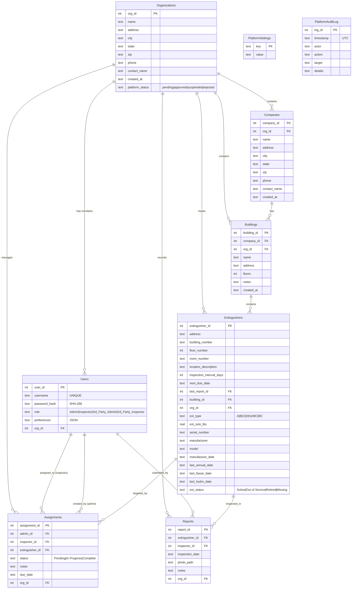
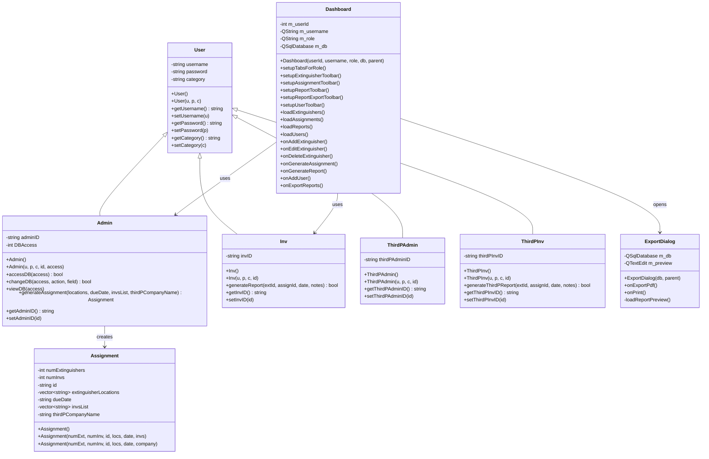
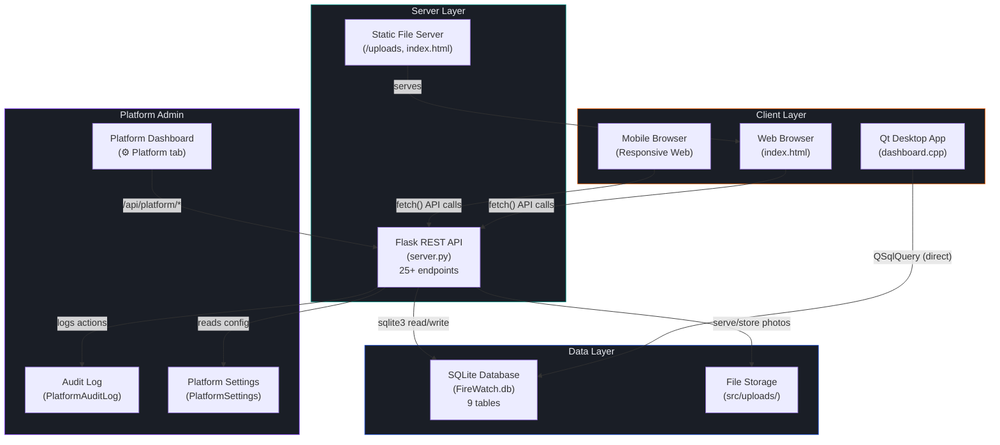
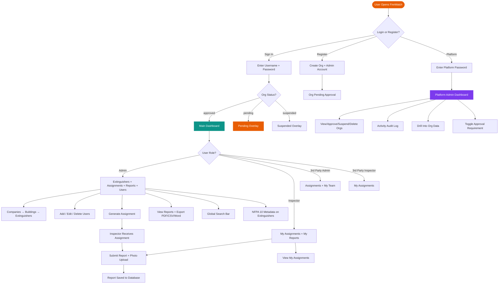
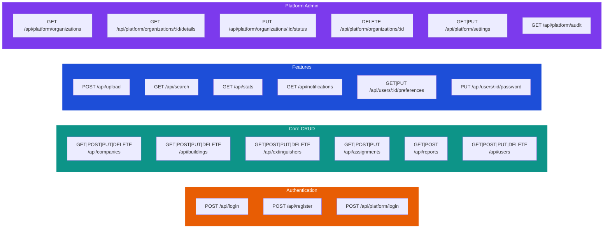

# FireWatch — UML Diagrams
**Updated:** March 24, 2026  
**Matches:** Current production schema (`server.py` + `FireWatch.db`)

---

## 1. Entity-Relationship Diagram (Database Schema)

---

## 2. C++ Class Diagram (Desktop Application)

---

## 3. System Architecture Diagram

---

## 4. User Flow / Activity Diagram

---

## 5. API Endpoint Map

