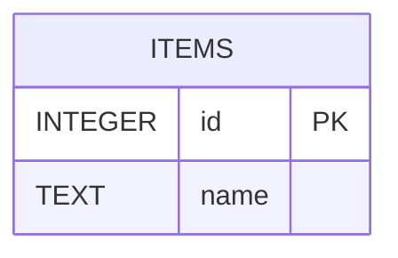

Full implementation bundle for edit/delete user feature.
Includes backend C++, Qt UI placeholder, Flask endpoints, migration.

# UML Diagram Documentation
This directory contains Mermaid UML diagrams for Iteration 2 and 3.
Each file can be rendered using Mermaid Live Editor.
Refer to diagram names for context.
# ERD

