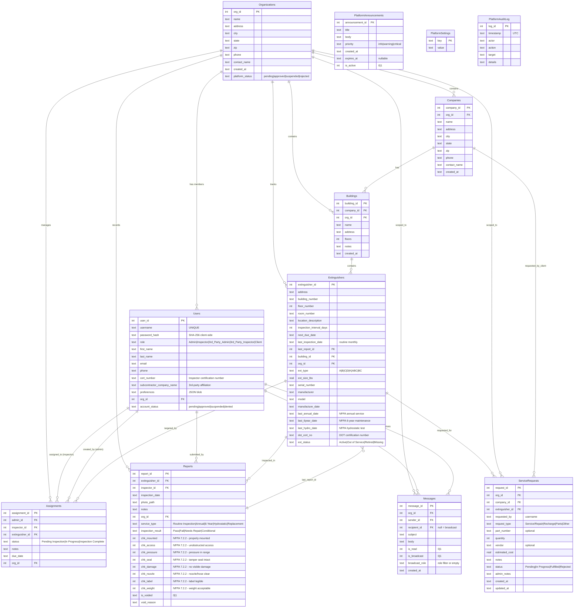
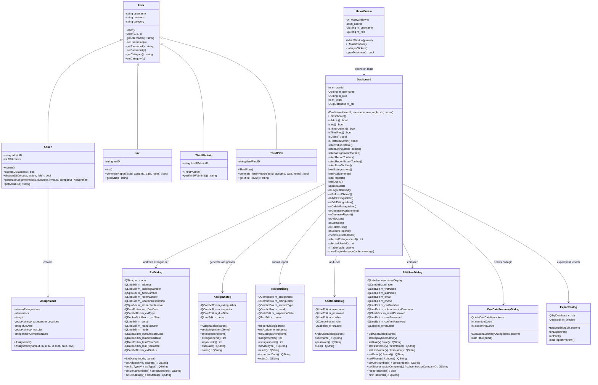
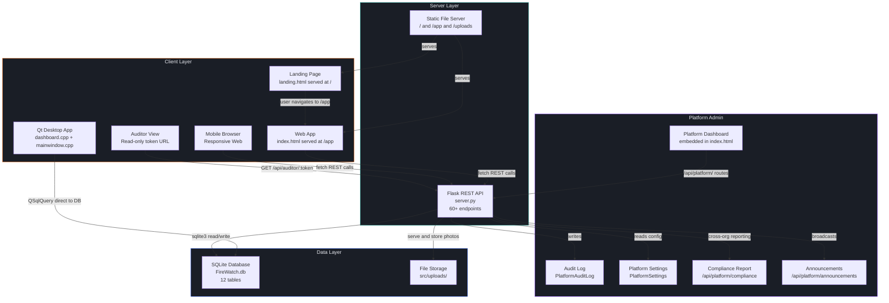
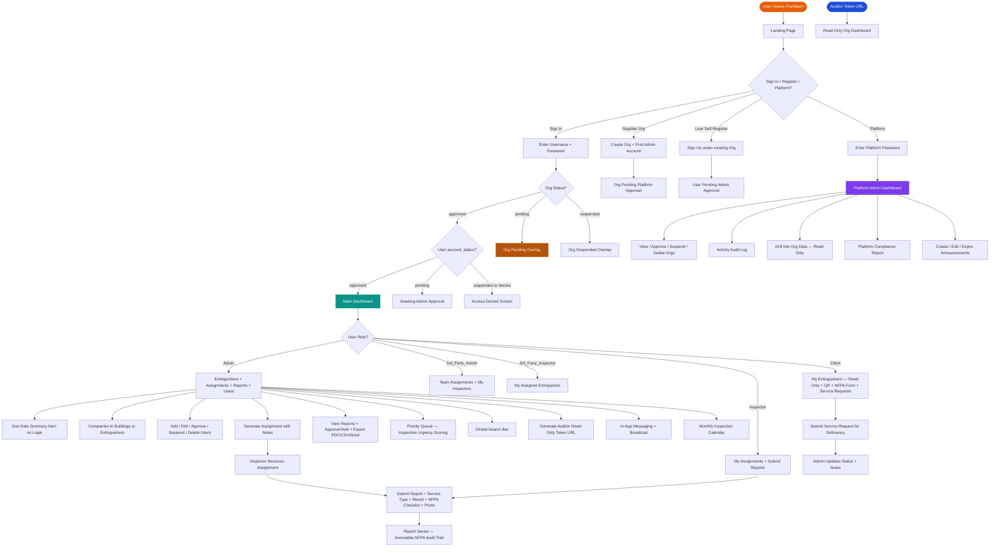
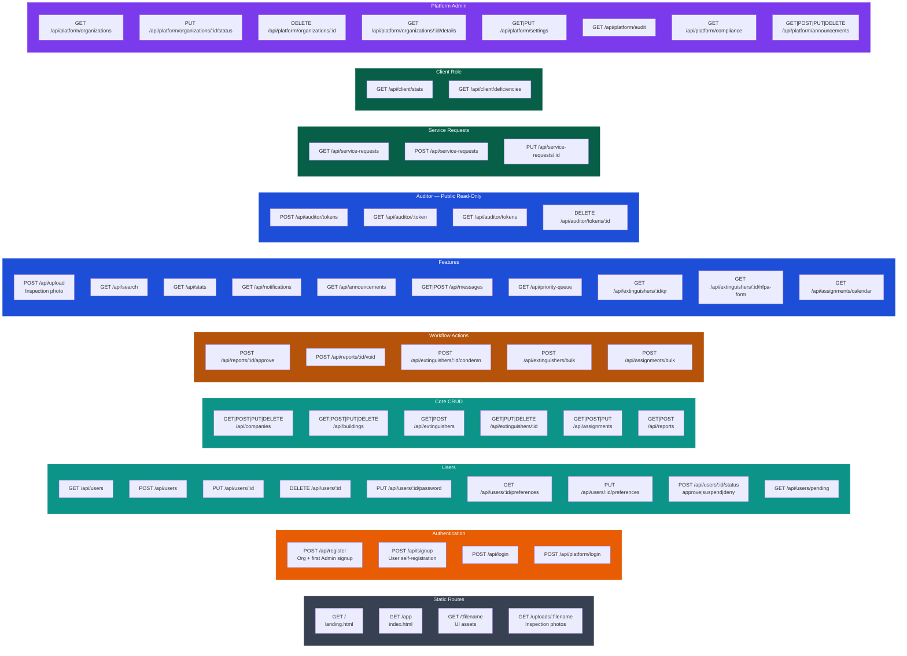
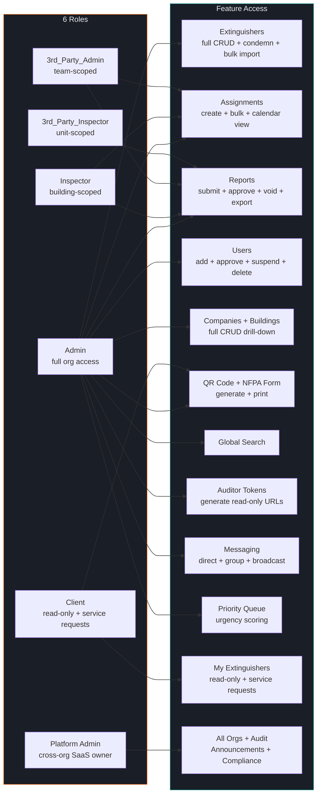

# FireWatch — UML Diagrams
**Updated:** April 20, 2026
**Matches:** Sprint 5 final production state (`server.py` + `FireWatch.db` + Qt desktop app)

---

## 1. Entity-Relationship Diagram (Database Schema)

---

## 2. C++ Class Diagram (Desktop Application)

---

## 3. System Architecture Diagram

---

## 4. User Flow / Activity Diagram

---

## 5. API Endpoint Map

---

## 6. Role Permission Matrix

