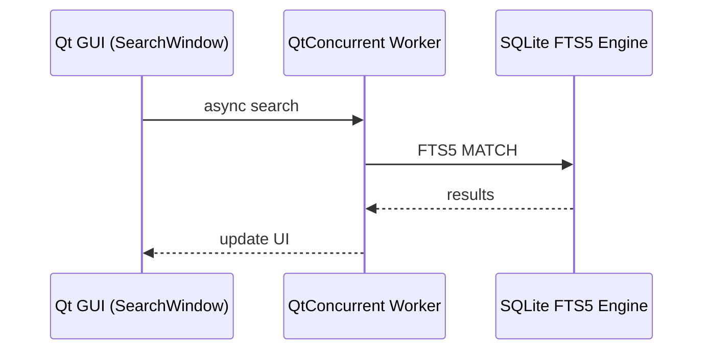

## Sequence Diagram

```mermaid
sequenceDiagram
    participant UI as Qt GUI (SearchWindow)
    participant Worker as QtConcurrent Worker
    participant DB as SQLite FTS5 Engine
    UI->>Worker: async search
    Worker->>DB: FTS5 MATCH
    DB-->>Worker: results
    Worker-->>UI: update UI
```
